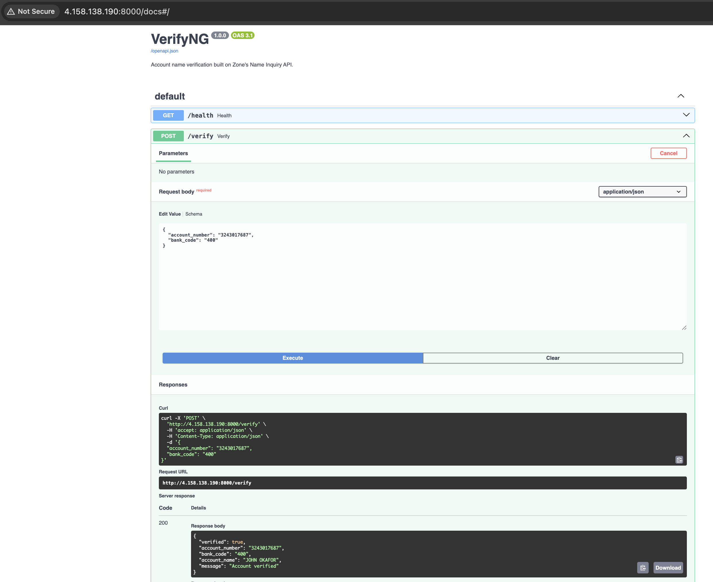

# VerifyNG — Build & Deploy Guide

Your walkthrough, straight to a live service on Azure, published on GitHub. No
local setup, no testing detours — you build the container in the cloud, deploy
it, and test the live thing. If anything goes wrong, you can tear it all down
and redo it in minutes.

Every step explains **what** you're doing and **why**, and flags **where to take
a screenshot** for your repo (the 📸 markers). Go at your own pace, and message
me at any step that doesn't behave.

---

## Part 1 — The idea, in plain English

### What an API is
An API is just a way for two programs to talk over the internet. One program
**sends a request** ("here's an account number, what's the name?") and the other
**sends back a response** ("the name is John Okafor"). That's it.

### What you're building
**VerifyNG** is a small service that does the account-name check you see every
time you send money in a banking app: you enter an account number and pick a
bank, and the account holder's name appears so you know you're paying the right
person. It does this by talking to **Zone's Name Inquiry API**.

So VerifyNG plays two roles at once: it **is an API** (other people call it), and
it **calls another API** (Zone's) to get the answer. Sitting in the middle is
what an integration engineer does — but the real substance of this project, and
the part you talk about, is the **infrastructure**: containerizing the service
and running it on Azure with monitoring.

### How the pieces connect
```
You / a form  ->  VerifyNG (your service)  ->  Zone Name Inquiry API
                        |
                        +-->  Application Insights  (logs every check, for monitoring)
```

VerifyNG runs inside a **Docker container** (a sealed box holding your app and
everything it needs). The container image is stored in **Azure Container
Registry (ACR)**, and it runs on **Azure Container Instances (ACI)** — the same
path you used for NairaFX.

### Mock mode (and why it's the right call)
Zone's docs are about three years old, so their test endpoint may or may not
still respond. The project runs in **mock mode** by default — it returns
realistic answers with no credentials needed — so you can build, deploy, and
demo the whole thing today without waiting on anyone. The code is still written
to Zone's real API, so when a Zone contact gives you a real token later,
switching to live mode is a few lines, not a rebuild.

---

## Part 2 — What you need

You already have an Azure subscription. Install/confirm just these:

| Tool | Why | Get it |
|------|-----|--------|
| **Azure CLI** (`az`) | Creates and manages everything in Azure from your terminal | https://learn.microsoft.com/cli/azure/install-azure-cli |
| **Git** | Pushes your project to GitHub | https://git-scm.com/downloads |
| **GitHub account** | Where the repo lives | https://github.com |
| **VS Code** (optional) | To view/edit files | https://code.visualstudio.com |

> **You do NOT need Python or Docker installed.** Azure builds the container and
> runs it for you. You just need the project files (the folder you were given)
> and the tools above.

Confirm they work:
```bash
az version
git --version
```

---

## Part 3 — The project, file by file

You have the full project already. Here's what every file is for, so nothing is
a mystery:

```
verifyng/
├── app/                    ← all the application code lives in this package
│   ├── __init__.py         ← marks "app" as a Python package (can be empty)
│   ├── main.py             ← the API: defines the endpoints (/verify, /health...)
│   ├── zone_client.py      ← the integration: calls Zone's Name Inquiry API
│   └── models.py           ← the shapes of the request and response data
├── Dockerfile              ← the recipe Azure uses to build the container image
├── requirements.txt        ← the Python libraries the app needs
├── .dockerignore           ← files to keep OUT of the container image
├── .gitignore              ← files to keep OUT of GitHub
├── .env.example            ← a reference for the available settings
├── README.md               ← the public front page of your repo
├── BUILD_GUIDE.md          ← this guide
└── screenshots/            ← where your screenshots go for the repo
```

**Why split the code into three files?** Each has one job: `models.py` describes
*what the data looks like*, `zone_client.py` handles *talking to Zone*, and
`main.py` handles *receiving requests and sending responses*. Keeping them
separate is what makes a codebase easy to read — and it shows an interviewer you
think about structure.

First, put the project folder somewhere sensible and open a terminal there:
```bash
cd ~/projects/verifyng      # adjust to wherever you put it
```

---

## Part 4 — Set up Azure

**Step 4a — log in**
```bash
az login
```
A browser opens; sign in.

**Step 4b — create a resource group** (a folder for all your Azure resources)

**Why:** it keeps everything for this project together, and lets you delete it
all in one command later.
```bash
az group create --name verifyng-rg --location uksouth
```

**Step 4c — create the container registry (ACR)**

**Why:** ACR is your private store for the container image. Azure builds your
image into here, then runs it from here. The name must be globally unique and
letters/numbers only.
```bash
az acr create --resource-group verifyng-rg --name verifyng<unique>acr --sku Basic
```
(Replace `<unique>` with a few random characters, e.g. `verifyng7k2acr`.)

📸 **Screenshot:** the ACR resource in the Azure Portal.
*(Save as `screenshots/01-acr.png`.)*

**Step 4d — create Application Insights (your monitoring)**

**Why:** this is where your logs go, so you can *see* what your service is doing
and prove it's monitored — a core part of the cloud-operations story.
```bash
az extension add --name application-insights   # if not already installed

az monitor app-insights component create \
  --app verifyng-ai \
  --location uksouth \
  --resource-group verifyng-rg \
  --application-type web

# copy the connection string it prints (you need it when you deploy):
az monitor app-insights component show \
  --app verifyng-ai \
  --resource-group verifyng-rg \
  --query connectionString -o tsv
```

---

## Part 5 — Build your container image in the cloud

**What:** Azure reads your `Dockerfile` and builds the container image straight
into your registry.

**Why:** the `Dockerfile` is the recipe (start from Python, install the
libraries, copy in your code, launch the app). `az acr build` runs that recipe
on Azure's side and stores the finished image in ACR — no Docker needed on your
machine.

Run this from the project root (where the `Dockerfile` is):
```bash
az acr build --registry verifyng<unique>acr --image verifyng:latest .
```

📸 **Screenshot:** the terminal showing the build finished and the image pushed.
*(Save as `screenshots/02-acr-build.png`.)*

---

## Part 6 — Deploy to Azure Container Instances (ACI)

**What:** run your container in the cloud with a public address.

**Why:** this is the live deployment — your service on the internet.

First, let ACI pull from your registry by enabling its admin login:
```bash
az acr update --name verifyng<unique>acr --admin-enabled true
az acr credential show --name verifyng<unique>acr
```
Note the **username** and one **password** from that output. Then get your
registry's login server:
```bash
az acr show --name verifyng<unique>acr --query loginServer -o tsv
```
(That looks like `verifyngxxxxacr.azurecr.io`.)

Now create the container. Paste your real values where shown:
```bash
az container create \
  --resource-group verifyng-rg \
  --name verifyng \
  --image <loginServer>/verifyng:latest \
  --registry-login-server <loginServer> \
  --registry-username <acr-username> \
  --registry-password <acr-password> \
  --dns-name-label verifyng-<unique> \
  --ports 8000 \
  --os-type Linux --cpu 1 --memory 1 \
  --environment-variables USE_MOCK=true \
  --secure-environment-variables APPLICATIONINSIGHTS_CONNECTION_STRING="<your-app-insights-connection-string>"
```

**What the important bits mean:**
- `--dns-name-label` gives your container a friendly web address.
- `--environment-variables USE_MOCK=true` runs it in reliable mock mode.
- `--secure-environment-variables` hides the connection string from the
  container's public details.

Get your live address:
```bash
az container show --resource-group verifyng-rg --name verifyng \
  --query ipAddress.fqdn -o tsv
```
That prints something like `verifyng-xxxx.uksouth.azurecontainer.io`.

📸 **Screenshot:** the container's **Overview** page in the Azure Portal (status
**Running**). *(Save as `screenshots/03-aci-running.png`.)*

> **Trying Zone's real endpoint later:** staying in mock mode keeps your demo
> reliable. If a Zone contact ever gives you a real token, just run the
> `az container create` step again with `USE_MOCK=false` and add
> `ZONE_API_KEY=<your-token>` to the secure environment variables.

---

## Part 7 — Test your live service

**What:** call your service on the internet.

**Why:** the proof it all works, end to end, in the cloud.

In your browser, open:
```
http://<your-fqdn>:8000/docs
```
This is the interactive API page FastAPI generates for you. Expand **POST
/verify**, click **Try it out**, enter account number `3243017687` and bank code
`400`, and click **Execute** — you'll get back a verified result with a name. Try
`1234567890` to see the "does not exist" case, and **GET /recent** to see the
checks you've made.

📸 **Screenshot:** the live `/docs` page (with the cloud address in the URL bar)
showing a successful response. *(Save as `screenshots/04-live-verify.png`.)*
**This is your hero shot.**

---

## Part 8 — Confirm observability

**What:** open your **Application Insights** resource (`verifyng-ai`) in the portal.

**Why:** monitoring is part of the job — you're showing you can *see* your
running system, not just launch it.

Go to **Logs** (left menu) and run:
```kusto
traces
| where message startswith "Verify"
| order by timestamp desc
```
You'll see your "Verify request" and "Verify result" log lines, with the account
numbers masked (a privacy detail worth pointing out in interviews).

📸 **Screenshot:** the Logs results showing your verification activity.
*(Save as `screenshots/05-app-insights.png`.)*

---

## Part 9 — Publish to GitHub

Run these from the project root (where `README.md` is).

**Step 9a — create the repo**
1. Go to https://github.com/new
2. Name: `verifyng`
3. Description: *"Account name verification service built on Zone's Name Inquiry API (FastAPI, Docker, Azure)."*
4. Leave it **empty** — no README or .gitignore (you already have them).
5. Click **Create repository** and copy the URL it shows.

**Step 9b — connect and push**

Each command has a job: start tracking, stage files, save a snapshot, name the
branch, link GitHub, upload.
```bash
git init
git add .
git commit -m "VerifyNG: account verification on Zone's Name Inquiry API"
git branch -M main
git remote add origin https://github.com/yourname/verifyng.git
git push -u origin main
```

Refresh GitHub — your code is live and the README renders with the diagram.

---

## Part 10 — Add your screenshots

**What:** put your captured images into `screenshots/` and push again.

**Why:** screenshots make a repo credible at a glance — they prove it runs.
```bash
git add screenshots/
git commit -m "Add deployment and observability screenshots"
git push
```
Then, to make the repo pop, add the hero shot near the top of `README.md`:
```markdown

```
Commit and push that too.

---

## How to talk about it in an interview

> "I built a service that integrates Zone's Name Inquiry API — the
> account-verification step before a transfer. I containerized it with Docker,
> built the image into Azure Container Registry, and deployed it on Azure
> Container Instances, with Application Insights for monitoring and masked
> account numbers in the logs. It runs in a mock mode so it works without partner
> credentials — switching to live is just configuration."

That sentence covers containers, a registry, cloud compute, observability, and
privacy — the heart of a cloud-operations role.

---

## Cleaning up (optional)

This setup costs very little, so you can leave it running as a live demo. To
remove everything when you're done:
```bash
az group delete --name verifyng-rg --yes --no-wait
```
That deletes the resource group and everything in it in one go.

---

That's the whole build — straight to deployed, no detours. Work through it at
your pace, and if a step misbehaves, tell me where you are and the exact error,
and I'll get you unstuck.
