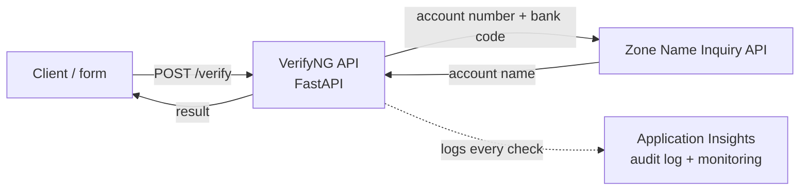

# VerifyNG

An account name verification service built on **Zone's Name Inquiry API**. Give it a Nigerian bank account number and bank code; it calls Zone, returns the account holder's name (or a clear "not found"), logs every check, and serves the result through a clean API.

> This is the "confirm the recipient's name before you send money" step that every Nigerian banking app performs — built as a real integration against Zone's published API.

## Architecture



Runs as a Docker container on Azure Container Instances; the image is stored in Azure Container Registry.

## Endpoints

- `POST /verify` — verify an account number, return the account name
- `GET /recent` — the last few checks from this run
- `GET /health` — liveness check
- `GET /docs` — auto-generated interactive API documentation

## Example

Request:
```json
POST /verify
{ "account_number": "3243017687", "bank_code": "400" }
```
Response:
```json
{
  "verified": true,
  "account_number": "3243017687",
  "bank_code": "400",
  "account_name": "JOHN OKAFOR",
  "message": "Account verified"
}
```

## How the Zone integration works

The service calls Zone's Name Inquiry endpoint with the required `x-Api-key` header, in one of two modes:

- **Mock mode** (default) — returns realistic Zone-shaped responses so the service runs with no credentials.
- **Live mode** — set `USE_MOCK=false` and provide `ZONE_API_KEY` to call Zone's real test endpoint.

Either way the integration is written to Zone's real API contract, so switching to live is a configuration change, not a code change.

## Tech stack

- Python 3.11 + FastAPI
- httpx (HTTP client)
- Docker → Azure Container Registry → Azure Container Instances
- Application Insights (observability)

## Repository structure

```
verifyng/
├── app/
│   ├── main.py         # the API endpoints
│   ├── zone_client.py  # the Zone Name Inquiry integration
│   └── models.py       # request/response shapes
├── Dockerfile
├── requirements.txt
├── .env.example
└── screenshots/
```

## Run it / deploy it

See **[BUILD_GUIDE.md](BUILD_GUIDE.md)** for the full step-by-step walkthrough.

## Observability

Every verification is logged with the account number masked. With an Application Insights connection string set, logs and request traces flow to Azure for querying and alerting.

## Privacy & production next steps

Account numbers are masked in logs. For production I would add a managed identity, a durable audit store, request signing where Zone requires it, and the full funds-transfer flow (verify → transfer → query).

## Credit

Built against [Zone's published API documentation](https://card-present.readme.io/reference/introduction).
